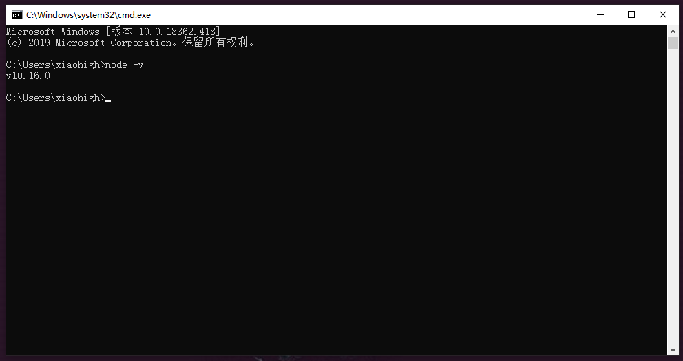
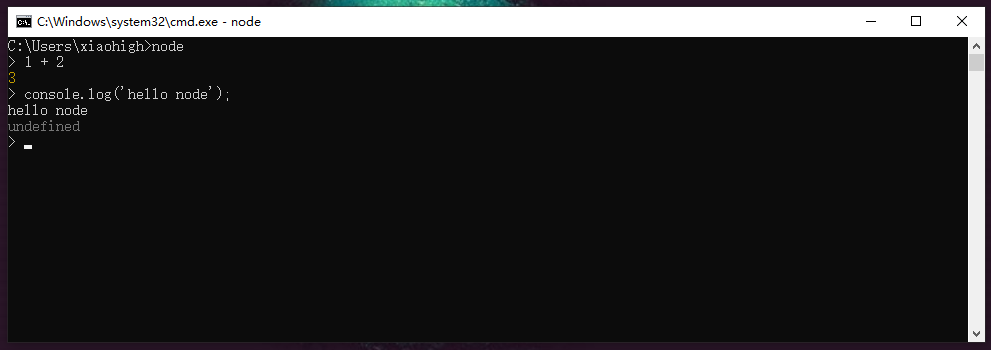
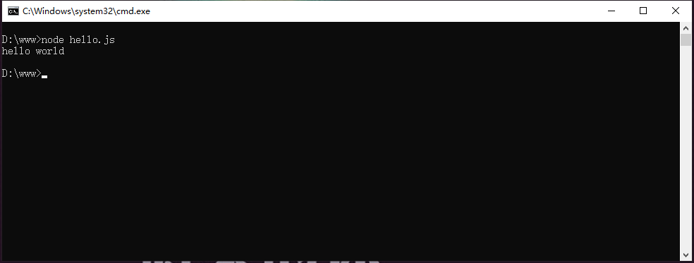
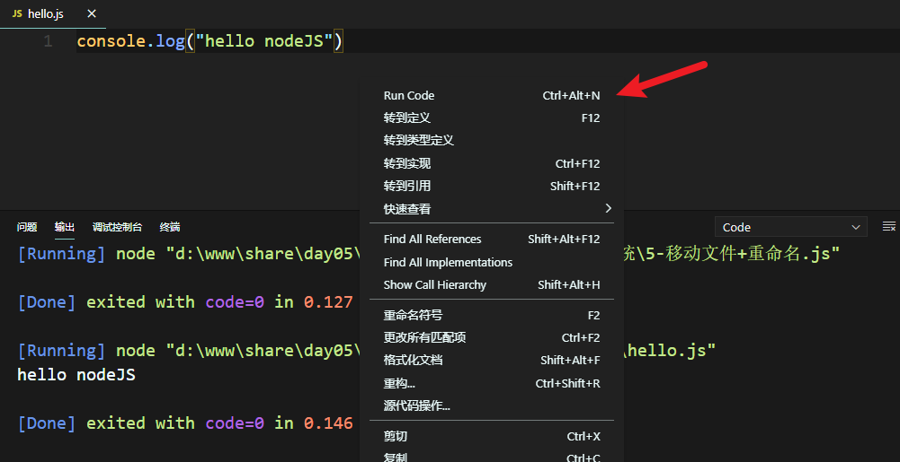

# Nodejs

## 介绍

Node.js 是一个基于 Chrome V8 引擎的 JavaScript 运行环境，是一个应用程序。

官方网址 <https://nodejs.org/en/>，中文站 <http://nodejs.cn/>

## 作用

- 解析运行 JS 代码
- 操作系统资源，如内存、硬盘、网络

## 应用场景

* APP 接口服务
* 聊天室
* 动态网站, 个人博客, 论坛, 商城等
* 后端的Web服务，例如服务器端的请求（爬虫），代理请求（跨域）
* 前端项目打包(webpack, gulp)

## 使用

### 下载安装

工具一定要到官方下载，历史版本下载 <https://npm.taobao.org/mirrors/node/>

Nodejs 的版本号奇数为开发版本，偶数为发布版本，我们选择偶数号的 LTS 版本（长期维护版本 long term service）

双击打开安装文件，一路下一步即可😎，默认的安装路径是 `C:\Program Files\nodejs`

安装完成后，在 CMD 命令行窗口下运行 `node -v`，如显示版本号则证明安装成功，反之安装失败，重新安装。 

### 初体验

#### 交互模式

在命令行下输入命令 `node`，这时进入 nodejs 的交互模式

#### 文件执行

创建文件 hello.js ，并写入代码 console.log('hello world')，命令行运行 `node hello.js`

快速启动命令行的方法

* 在文件夹上方的路径中，直接输入 cmd 即可
* 使用 webstorm 和 vscode 自带的命令行窗口

#### VScode 插件运行

安装插件 『code Runner』, 文件右键 -> run code

#### 注意

在 nodejs 环境下，不能使用 BOM 和 DOM ，也没有全局对象 window，全局对象的名字叫 global

### Buffer(缓冲器)

#### 介绍

Buffer 是一个和数组类似的对象，不同是 Buffer 是专门用来保存二进制数据的

#### 特点

* 大小固定：在创建时就确定了，且无法调整
* 性能较好：直接对计算机的内存进行操作
* 每个元素大小为 1 字节（byte）

#### 操作

##### 创建 Buffer

* 直接创建 Buffer.alloc
* 不安全创建 Buffer.allocUnsafe

* 通过数组和字符串创建 Buffer.from

##### Buffer 读取和写入

可以直接通过 `[]` 的方式对数据进行处理，可以使用 toString 方法将 Buffer 输出为字符串

* ==[ ]== 对 buffer 进行读取和设置
* ==toString== 将 Buffer 转化为字符串

##### 关于溢出

溢出的高位数据会舍弃

##### 关于中文

一个 UTF-8 的中文字符大多数情况都是占 3 个字节

##### 关于单位换算

1Bit 对应的是 1 个二进制位

8 Bit = 1 字节（Byte）

1024Byte = 1KB 

1024KB = 1MB

1024MB = 1GB

1024GB = 1TB

平时所说的网速 10M 20M 100M 这里指的是 Bit ，所以理论下载速度 除以 8 才是正常的理解的下载速度

### 文件系统 fs

fs 全称为 file system，是 NodeJS 中的内置模块，可以对计算机中的文件进行增删改查等操作。

##### 文件写入

* 简单写入
  * fs.writeFile(file, data, [,options], callback);
  * fs.writeFileSync(file, data);
  * options 选项
    * `encoding` **默认值:** `'utf8'`
    * `mode`**默认值:** `0o666`
    * `flag` **默认值:** `'w'`
* 流式写入
  * fs.createWriteStream(path[, options])
    * path
    * options
      * ==flags==   **默认值:** `'w'`
      * `encoding `**默认值:** `'utf8'`
      * `mode`   **默认值:** `0o666`
    * 事件监听 open  close  eg:  ws.on('open', function(){});

##### 文件读取

* 简单读取
  * fs.readFile(file, function(err, data){})
  * fs.readFileSync(file)
* 流式读取
  * fs.createReadStream();

##### 文件删除

* fs.unlink('./test.log', function(err){});
* fs.unlinkSync('./move.txt');

##### 移动文件 + 重命名

* fs.rename('./1.log', '2.log', function(err){})
* fs.renameSync('1.log','2.log')

##### 文件夹操作

* mkdir  创建文件夹
  * path
  * options 
    * recursive 是否递归调用
    * mode  权限 默认为 0o777
  * callback 
* rmdir 删除文件夹
* readdir  读取文件夹

## 附录

### unicode 字符集

* https://www.tamasoft.co.jp/en/general-info/unicode.html

* https://www.cnblogs.com/whiteyun/archive/2010/07/06/1772218.html    